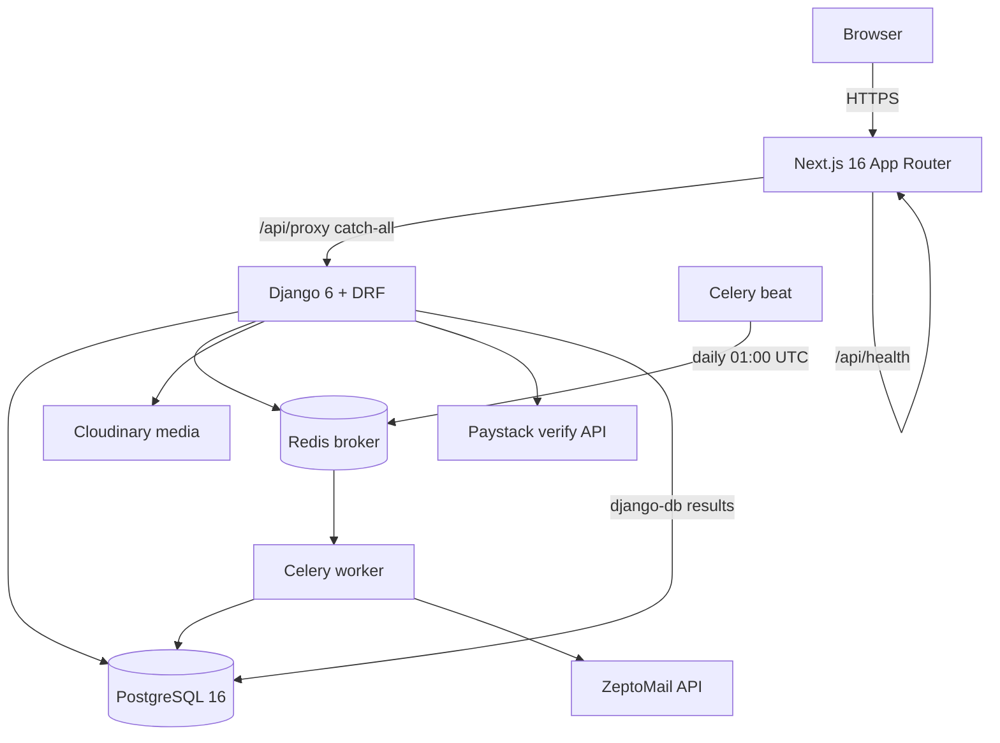
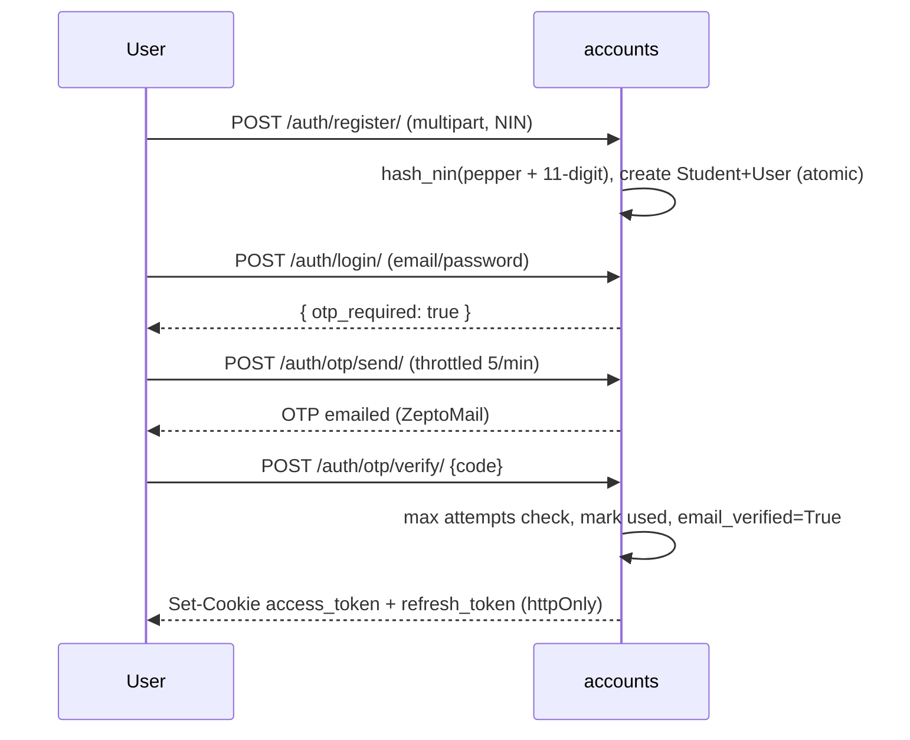
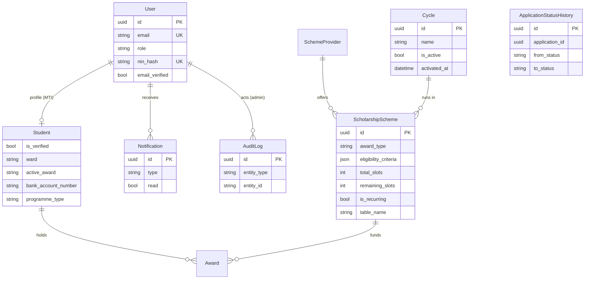
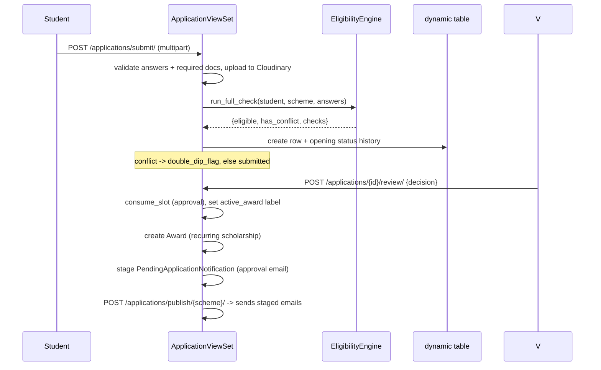
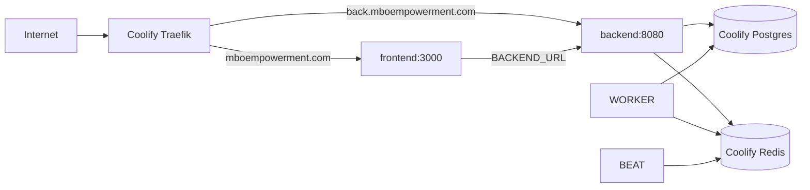

# Mbo Youth Empowerment Portal — System Design

Status: Living document. Audience: engineers, reviewers, ops.
Scope: the whole platform — Next.js frontend, Django/DRF backend, data model, async jobs and
Coolify deployment.
Related: `mbo_youth_emp/AWARDS_SYSTEM_DESIGN.md` (deep-dive on recurring scholarships),
`mbo_youth_emp/RECURRING_SCHOLARSHIPS_PLAN.md`, `DEPLOYMENT.md`, `mbo_youth_emp/CHANGELOG.md`.

---

## 1. Overview

The Mbo Youth Empowerment Portal is a NIN-anchored digital pipeline that lets the Royal Mbo Host
Community Development Trust disburse PIA host-community funds to Mbo youths transparently. It
replaces paper intake and manual registers with one verified, auditable, self-service system for
three award categories:

- **Scholarships** (academic; includes multi-year recurring scholarships, see the awards deep-dive),
- **Empowerment / vocational training**,
- **Grants** (small-business).

Core capabilities: identity verification (NIN + document/passport), bank-account name matching,
eligibility + double-dip enforcement, per-scheme application intake, verifier review/approval,
beneficiary/disbursement exports, audit logging, notifications/email, and cycle management.

---

## 2. Goals / Non-goals

**Goals**

- One NIN = one account; no duplicate beneficiaries.
- Rules enforced by an engine (eligibility, ward, slots, CPGA/age, double-dip), not a clerk.
- Money lands with the right person (bank name-match before submission).
- Accountability by default: append-only status history + admin audit log.
- Operate cheaply and simply (single Coolify stack; managed Postgres/Redis; Cloudinary for media).

**Non-goals / current limitations**

- No server-side route middleware; client-side guard + layout `getMe()` checks.
- A hard blacklist / disqualifications *model* does not exist (the admin "Disqualifications" view
  derives from `rejected` applications).
- Frontend for recurring scholarships is **not built** yet (handoff plan only).

---

## 3. High-level architecture

Two deployable apps:
- **Frontend** — Next.js, repo root (`src/`), container behind Coolify's proxy.
- **Backend** — Django/DRF, `mbo_youth_emp/`, served by gunicorn, plus `worker` and `beat` containers.

PostgreSQL and Redis are **Coolify-managed resources**, not containers in the compose file.

---

## 4. Tech stack

| Layer | Choice |
|---|---|
| Frontend | Next.js 16 (App Router, JavaScript), React 19, Tailwind v4, lucide-react, Recharts, axios |
| Backend | Django 6, DRF, drf-spectacular, SimpleJWT, Celery |
| Database | PostgreSQL 16 (django-db Celery result backend) |
| Broker | Redis |
| Media | Cloudinary (`MediaCloudinaryStorage`) |
| Email | ZeptoMail (Zoho) |
| Payments/KYC | Paystack (bank account resolution + name match) |
| Static | WhiteNoise |
| Deploy | Docker Compose on Coolify (Traefik proxy) |

---

## 5. Components

### 5.1 Frontend (`src/`)

- **App Router**, no TypeScript, no `(auth)` route group. Three client layouts:
  `src/app/layout.js` (root), `src/app/dashboard/layout.js` (student), `src/app/admin/layout.js`.
- **Route areas**: marketing `/`; auth `/login`, `/register`, `/forgot-password`; student
  `/dashboard/**` (programmes, apply, applications, profile, notifications, policy, help, settings);
  admin `/admin/**` (overview, applications, approvals, students, schemes, cycles, providers,
  beneficiaries, disqualifications, audit-log, settings).
- **API access**: every call goes through `src/services/*` → `axiosInstance` (`baseURL: /api/proxy`,
  `withCredentials: true`). The proxy route `src/app/api/proxy/[...path]/route.js` forwards to
  `BACKEND_URL` and passes `Cookie`/`set-cookie` through, which is what makes httpOnly JWT cookies
  work cross-origin (and fixed mobile Safari).
- **Auth UX**: login = email/password → OTP → cookies; register = 4-step wizard (multipart) → OTP;
  forgot-password = email → OTP → reset. `useRoleGuard` + layouts enforce access; `src/middleware.js`
  is a no-op.
- **Barrel export**: `src/services/index.js` re-exports `auth`, `students`, `schemes`,
  `applications`, `verification`, `notifications`.

> Known gaps: `src/services/awards.js` and all `/awards` pages don't exist yet. Some service
> functions are dead (`verification.verifyNIN`, some `auth.*AdminUser`, `students.*AcademicRecords`)
> because the backend endpoints were removed.

### 5.2 Backend (`mbo_youth_emp/`) — Django apps

| App | Responsibility |
|---|---|
| `accounts` | custom `User`, roles, NIN hashing, email OTP, cookie JWT, password reset, throttles, upload validators |
| `students` | `Student` (MTI child of `User`) academic/bank profile |
| `schemes` | `Cycle`, `SchemeProvider`, `ScholarshipScheme`; dynamic-table signals |
| `applications` | per-scheme dynamic application tables, statuses, slots, eligibility engine, review |
| `awards` | recurring multi-year scholarships (see awards deep-dive) |
| `verification` | Paystack bank verification (no models) |
| `audit` | append-only `AuditLog` for admin actions |
| `notifications` | in-app `Notification` rows + factory helpers |
| `health` | DB liveness probe |
| `django_celery_results` | Celery result backend (`TaskResult`) |

### 5.3 The per-scheme dynamic application tables (key architectural quirk)

There is **no shared `Application` table**. Each `ScholarshipScheme` owns a physical table
`app_<id.hex>` (`ScholarshipScheme.table_name`), created at save time:

- `applications/dynamic.py` builds a `managed=False` Django model per scheme, memoised in
  `_MODEL_CACHE`; `build_application_table` / `drop_application_table` use `schema_editor`.
- `schemes/signals.py` wires `post_save` → build table (idempotent, self-healing) and
  `post_delete` → drop on commit; `schemes/apps.ready()` imports the signals.
- Cross-scheme reads are **Python-level UNIONs**: `iter_application_models()`, `find_application()`,
  `applications_for_student()`, `applications_by_status()`.
- Because tables are dynamic, anything referencing an application stores a **plain UUID**, never a
  FK: `ApplicationStatusHistory.application_id`, `PendingApplicationNotification.application_id`,
  `Award.application_id`.

Consequence for ops/tests: the suite is **Postgres-native** (SQLite can't run `schema_editor` DDL
inside `TestCase`). `manage.py rebuild_application_tables` repairs drift.

**Cross-scheme reads — unified `Application` projection (Phase 2).** Looping over every table per
request (`applications_by_status` / `applications_for_student` / `find_application`) is
`O(N_schemes)` queries plus an in-Python sort and post-materialization pagination. A single indexed,
fully-typed table (`applications.Application`) mirrors the whole application row — common fields,
every award type's answers, bank snapshot — kept in sync by a `post_save` receiver on
`ApplicationStatusHistory` and backfillable with `manage.py rebuild_application_projection`. When
`APPLICATIONS_USE_PROJECTION` is on, cross-scheme reads become one indexed query with SQL-side
pagination and `schemes_overview` becomes one `GROUP BY`. A second flag, `APPLICATIONS_WRITE_UNIFIED`,
flips the source of truth: the unified table is written and the per-scheme table is mirrored from it
(for rollback and legacy consumers), with `manage.py sync_legacy_from_projection` to rebuild the
mirror. Both flags default **off** so a live deployment backfills/soaks before each step (see
`DEPLOYMENT.md`). Dropping the dynamic tables entirely is the final Phase-2 step.

### 5.4 Async (`config/celery.py`, `verification/tasks.py`, `awards/tasks.py`)

- Broker `CELERY_BROKER_URL` (Redis); results in Postgres (`django-db`); JSON serializers;
  `CELERY_TASK_ALWAYS_EAGER` defaults on under `DEBUG` (in-process).
- Email tasks (`@shared_task(bind=True, max_retries=3, default_retry_delay=60)`): OTP, password reset,
  welcome, student verified, application submitted/approved, double-dip flagged, and award
  renewal/suspension/disbursement/graduation/appeal-decision.
- **Beat** (`config/celery.py`) runs a static schedule: daily 01:00 UTC `expire-recurring-renewals`
  → `awards.tasks.expire_awards`. Emails from state changes are dispatched via
  `transaction.on_commit` so a broker blip never breaks a committed transition.

### 5.5 External services

- **Cloudinary** — all uploads (passport, certificate, NIN slip, application documents, award
  transcripts/appeals). Validated at the boundary by `accounts/validators.validate_upload`
  (≤5 MB; jpeg/png/pdf).
- **Paystack** — `verification/services/paystack.py` resolves account names and scores a token
  overlap (≥ 0.6 passes); `PAYSTACK_MOCK_MODE` for dev.
- **ZeptoMail** — HTML templates in `templates/email/*.html`; `ZEPTO_MOCK_MODE` logs instead.

---

## 6. Identity & authentication

Roles: `student`, `verifier`, `admin`, `superadmin` (`accounts/models.Role`); permissions
`IsStudent`, `IsVerifier` (verifier+admin+superadmin), `IsAdmin` (admin+superadmin), `IsSuperAdmin`,
`IsDonor`.

- **NIN**: never stored raw — `hash_nin` = SHA-256(`NIN_HASH_PEPPER` + raw); a server-only pepper
  defends the tiny 11-digit keyspace. `nin_hash` is unique.
- **JWT**: `CookieJWTAuthentication` reads the `access_token` httpOnly cookie (Bearer header fallback);
  access 60 min, refresh 7 days, rotation + blacklist. The frontend axios interceptor transparently
  refreshes on 401.
- **OTP**: 6-digit, TTL 600 s, max 5 attempts, 60 s resend cooldown, throttled.
- **Password reset**: generic (no enumeration) email → OTP verify → confirm; blacklists outstanding
  tokens and clears cookies.
- **Throttles**: anon 60/min, user 1000/day, otp 5/min, auth 10/min.

---

## 7. Domain model

Per-scheme **application rows** live outside this diagram in their dynamic tables; their field set is
`_common_fields()` + `_award_fields(award_type)` (scholarship: institution/course/level/cgpa/
admission_year/matric; empowerment: trade/provider/duration/experience; grant: business/amount/use).

---

## 8. Applications subsystem

### 8.1 Status lifecycle

`ApplicationStatus`: `draft → submitted → (eligibility_check) → document_review/shortlisted/
double_dip_flag/waiver_required → approved | rejected`, plus `withdrawn`. Eligibility no longer
auto-rejects — ineligible applications land in `submitted` with `eligibility_passed=False`; only a
**conflict** short-circuits to `double_dip_flag`. `REVIEWABLE_STATUSES` drives the verifier queue.

### 8.2 Intake → review

- **Slots**: `consume_slot` is atomic (`remaining_slots__gt=0` + `F()-1`); `release_slot` returns the
  slot and clears the label. Withdrawal cascades to terminate a linked recurring award.
- **Approval emails are deferred** to a scheme Publish action (`PendingApplicationNotification`);
  rejection emails are deprecated.
- **Beneficiary/disbursement export** (`approved-list`, CSV) excludes applicants whose recurring
  award has since ended (terminated/graduated).

### 8.3 Eligibility engine (`applications/services/eligibility.py`)

`EligibilityEngine.run_full_check` → `{eligible, has_conflict, conflict_scheme_ids, checks}`.
Checks: slots, application window, ward restriction, prior-award cap, and double-dip. Per-type:
scholarship (CGPA, level, **programme-type gate for recurring**), empowerment (age, trade), grant
(age). Double-dip scans approved rows for the same academic year (`exclusive` either side, or both
`major_only` & both ≥ ₦50k) **plus** all live recurring `Award`s (cycle-independent; same scheme
always conflicts; suspended awards soft-flag). Overall `eligible = all non-conflict checks pass AND
no conflict`.

---

## 9. Recurring awards subsystem

Multi-year scholarships are a self-contained subsystem (`awards` app) with its own state machines,
rollover engine, expiry timers and appeal flow. Full detail — data model, transitions, tenure
resolver, API and permissions — is in **`mbo_youth_emp/AWARDS_SYSTEM_DESIGN.md`**. Integration
points with the rest of the platform:

- `ScholarshipScheme.is_recurring` (+ `min_renewal_cgpa`, `applicable_programme_types`).
- `Student` academic profile (`faculty`, `programme_type`, `programme_duration_years`, `entry_level`).
- Approval hooks in `applications/views.py` (`review`, `staff_create`) create the `Award`.
- `CycleViewSet.activate` runs `run_cycle_rollover`.
- `EligibilityEngine` programme-type gate + recurring double-dip.

---

## 10. Cross-cutting: notifications, audit, email

- **Notifications** (`notifications`): `Notification` rows surfaced at `/notifications/`; factory
  helpers in `notifications/helpers.py` (application lifecycle, staff queue alerts, award events).
- **Audit** (`audit`): `AuditLog` + `record_admin_action(...)` (never raises) called from admin
  views; exposed read-only at `GET /audit/` (admin/superadmin), paginated 100/page.
- **Email** (`verification/services/email.py` + `verification/tasks.py`): templated ZeptoMail,
  mockable, dispatched by Celery.

---

## 11. API surface

Top-level mounts (`config/urls.py`): `/admin/`, `/auth/`, `/students/`, `/applications/`,
`/schemes/`, `/awards/`, `/verification/`, `/audit/`, `/notifications/`, `/api/health/`,
`/api/schema/`, `/api/docs/`, `/api/redoc/`.

Highlights:
- **Auth** `/auth/`: register, login, otp/send|verify|resend, me, token/refresh, logout,
  password/reset/{request,verify,confirm}.
- **Applications** `/applications/`: list, mine, queue, flagged, by-scheme/{id}, approved-list
  (JSON/CSV), {id}/history, submit, staff-create, {id}/waiver, {id}/review, {id}/withdraw,
  publish/{scheme}, schemes-overview.
- **Schemes** `/schemes/`: schemes CRUD + publish/close/reopen/fields; providers; cycles
  (+ `/cycles/{id}/activate/`).
- **Students** `/students/`: CRUD, me, bank, stats, eligibility-check, {id}/verify.
- **Awards** `/awards/`: register/mine/detail, renew, appeal, suspend/terminate, renewals queue,
  installments/{id}/verify|disburse, appeals (+review), export.

The frontend reaches all of this through `/api/proxy`; the DRF schema is served at `/api/schema/`
and swagger at `/api/docs/`.

---

## 12. Security & data protection

- **NIN** hashed with a server-only pepper; raw never persisted; unique constraint.
- **Bank name matching** before submission (Paystack token overlap ≥ 0.6).
- **Auth cookies**: httpOnly JWT; `JWT_COOKIE_SAMESITE=None` + `JWT_COOKIE_SECURE=True` in prod
  (two cross-origin domains), relaxed in DEBUG.
- **Transport/headers**: `SECURE_SSL_REDIRECT`, `SECURE_PROXY_SSL_HEADER`, HSTS when
  `ENVIRONMENT=production`, `SECURE_CONTENT_TYPE_NOSNIFF`, `X_FRAME_OPTIONS=DENY`, referrer policy.
- **CORS/CSRF**: explicit allow-lists; credentials allowed.
- **Uploads**: type/size validated at the request boundary before storage.
- **Throttling**: anon/user/otp/auth scopes.
- **Network**: Postgres/Redis never published publicly (Coolify internal URL + firewall).

---

## 13. Deployment & operations

- Single Coolify Docker Compose resource (repo root `docker-compose.yml`): services `frontend`,
  `backend`, `worker`, `beat`; networks `default` + external `coolify`; **managed** Postgres/Redis.
- **Healthchecks**: frontend `/api/health` (Node fetch); backend `/api/health/` (urllib);
  worker `celery inspect ping`; beat has none.
- **Migrations** run automatically in the backend start command (`migrate --no-input && gunicorn`).
- **Required env** (see `.env.example`): `SECRET_KEY`, `NIN_HASH_PEPPER`, `DB_*` (host = DB Internal
  URL), `CELERY_BROKER_URL`, `CORS_ALLOWED_ORIGINS`, `CSRF_TRUSTED_ORIGINS`, `BACKEND_URL`,
  `CLOUDINARY_*`, `ZEPTO_*`, `PAYSTACK_*`, `RENEWAL_GRACE_DAYS`, `APPEAL_WINDOW_DAYS`,
  `RENEWAL_RESUBMISSION_CAP`.
- **Alt deployment (Shape B)**: `mbo_youth_emp/docker-compose.yml` bundles Postgres + Redis + Caddy
  for a self-contained backend VPS; frontend can run on Render with `BACKEND_URL` pointing at the
  backend. Root `Caddyfile` is unused under Coolify.
- **Ops tasks**: `docker compose exec backend python manage.py {createsuperuser|migrate|expire_renewals|rebuild_application_tables}`; beat logs via `docker compose logs -f beat`.

---

## 14. Failure modes & resilience

| Risk | Mitigation |
|---|---|
| Duplicate identities | unique `nin_hash`; one NIN = one account |
| Duplicate/oversold intake | atomic slot consume with `remaining_slots > 0` guard |
| Double-dipping | eligibility engine + recurring-award conflict scan (flag + waiver, not silent) |
| Application-table drift | `post_save` self-heals; `rebuild_application_tables` command |
| Broker/email down | side-effects swallowed; state commits regardless; emails on `on_commit` |
| Money double-pay (awards) | status-guarded transitions, terminal `disbursed`, index advances on disbursement only |
| Scheme deletion losing obligations | `Award.scheme` is `PROTECT` |
| Non-submission / lapsed appeals | daily beat job (`expire_awards`) |
| Cross-site cookie breakage | Next.js `/api/proxy` same-origin hop |
| Failed email on publish | `PendingApplicationNotification` keeps rows until sent |

---

## 15. Testing

- Django test runner (**Postgres required**). Service-level tests per app; the `awards` package is
  the largest (tenure fuzz, lifecycle, API permissions, appeals, rollover, expiry, eligibility,
  emails). Uploads use `override_settings(STORAGES=InMemoryStorage)`.
- Frontend: `npm run build` / `npm run lint` (no unit-test suite).

---

## 16. Roadmap / open items

- **Build the frontend for recurring scholarships** (`src/docs/Recurring_Scholarships_Frontend_Handoff.md`).
- **Applications read-model cutover** — run `rebuild_application_projection` and set `APPLICATIONS_USE_PROJECTION=True` (see `DEPLOYMENT.md`).
- **Phase 2**: unified `Application` table built, dual-written, and cutover-ready (`APPLICATIONS_USE_PROJECTION` read flag, `APPLICATIONS_WRITE_UNIFIED` write flag, `sync_legacy_from_projection`). Remaining: soak on write-unified, then execute the documented drop of the dynamic tables / `schemes/signals.py` machinery (`DEPLOYMENT.md`).
- Server-side route protection (currently client-only; `middleware.js` empty).
- Dead service functions / endpoints cleanup (`verification.verifyNIN`, admin-user management).
- Schedule/observe the `expire_renewals` beat job in every environment.
- Optional: `extend_award` spillover, richer CGPA-scale support, per-cycle budget caps.
