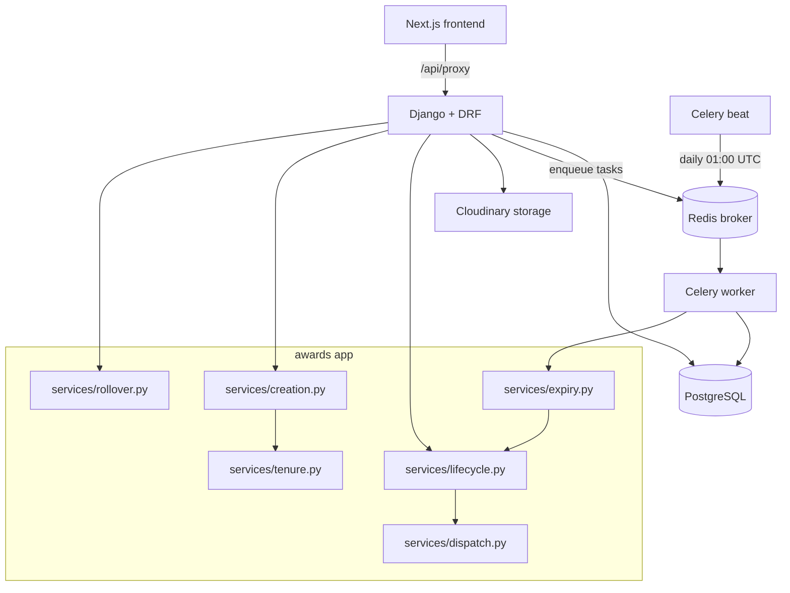
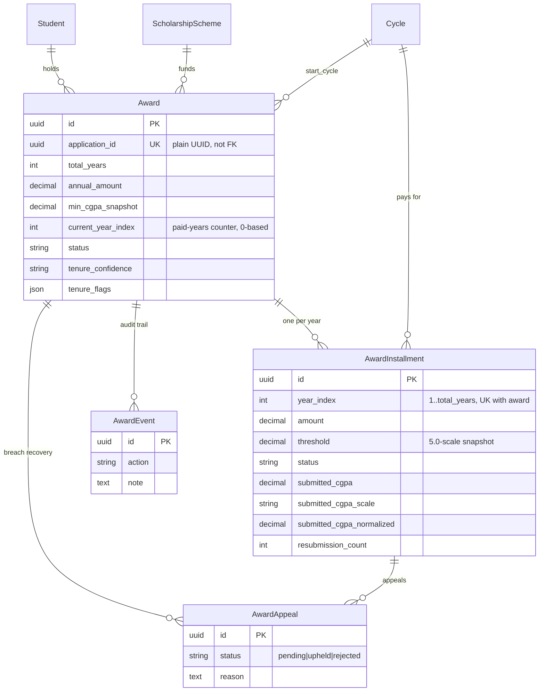
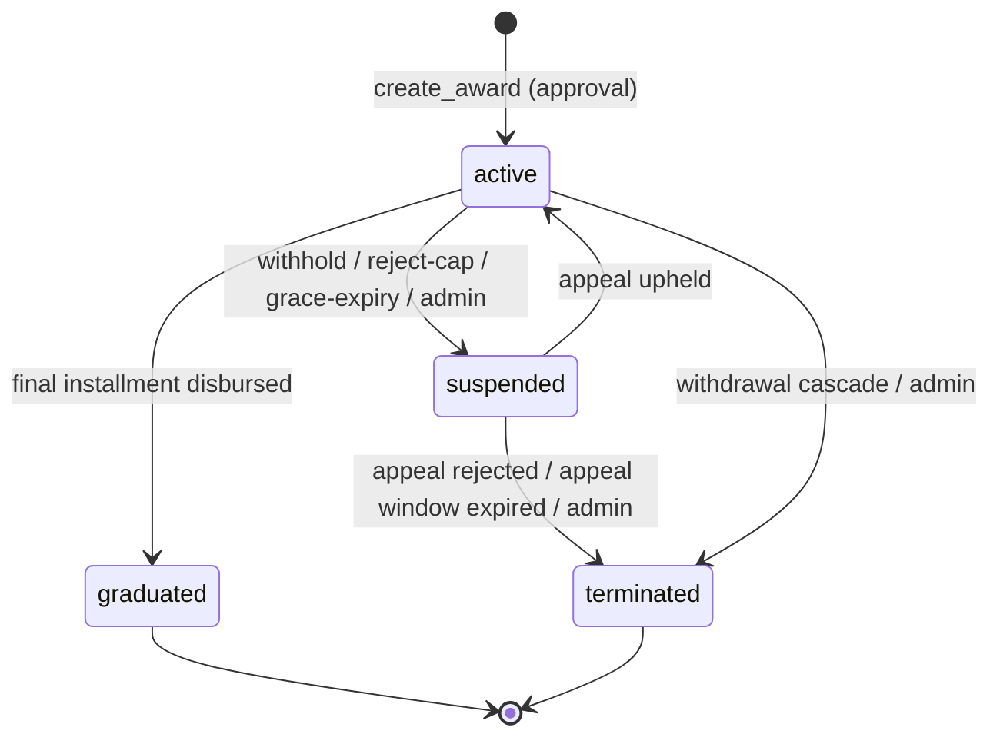
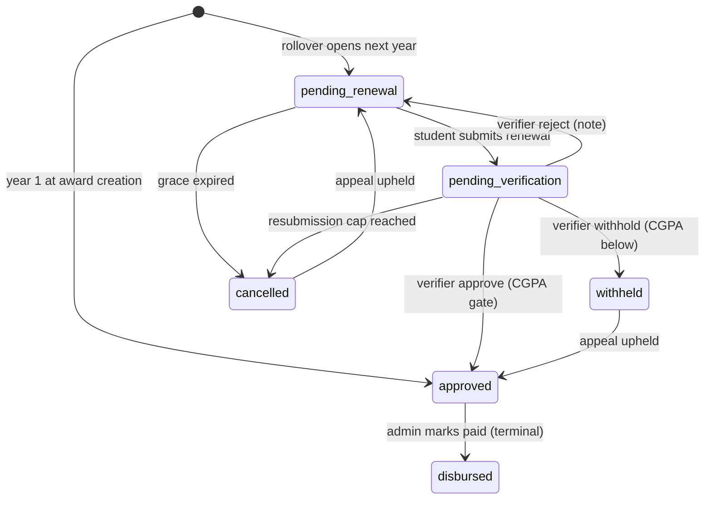
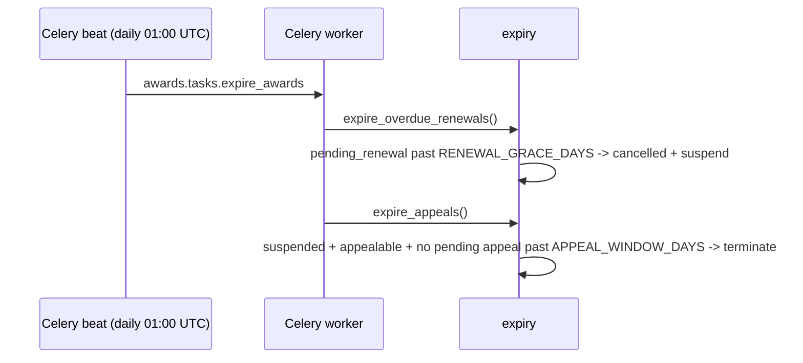

# Recurring Scholarships — System Design

Status: Implemented (backend). Audience: backend + frontend engineers, reviewers, ops.
Scope: the multi-year scholarship subsystem (`awards` app) and its integration points with
`schemes`, `students`, `applications`, `notifications` and Celery.
Source of truth for *what to build next* is `RECURRING_SCHOLARSHIPS_PLAN.md`; this document
describes *how the shipped system works*.

---

## 1. Overview

Historically every award in the portal was **one-shot**: approving an application consumed a
slot and stopped there. Recurring scholarships add a **multi-year contract** — a scholarship
that pays each academic year until the student graduates, re-checked annually against a CGPA
threshold, with a suspension/appeal path for breaches.

The system introduces:

- An `Award` (the multi-year contract) and one `AwardInstallment` per payment year.
- A yearly **renewal** flow: student submits → verifier approves → admin disburses.
- An **appeal** flow so a suspended student can contest a withheld/cancelled year.
- A **cycle rollover engine** that opens the next payment year when an admin activates a cycle.
- Two **time-based timers** (renewal grace expiry, appeal-window expiry) run by Celery Beat.

---

## 2. Goals / Non-goals

**Goals**

- Multi-year obligation that is auditable and never silently lost or overpaid.
- Zero regression for one-shot schemes (`is_recurring = False` is the default and no-ops everywhere).
- Every money movement is explicit, permission-gated and recorded (`AwardEvent` + `Award` audit).
- Idempotent under retries/double-clicks (approval, renew, verify, disburse, rollover).
- Never let a side-effect (email/broker) break a committed state transition.

**Non-goals**

- Budget caps per cycle (slots still cap *intake*, not recurring obligations).
- A hard blacklist / disqualifications register (rejected appeals only terminate the award).
- Representing CGPA scales other than 5.0 and 4.0.
- Automatic spillover extension (`extend_award`) beyond `total_years`.

---

## 3. Architecture



- **Django + DRF** serves `/awards/...`; state transitions live in `awards/services/*` (views are thin).
- **PostgreSQL** is required (tests included): each scheme owns a physical application table built
  via `schema_editor` on `post_save`, which SQLite forbids inside `TestCase`.
- **Redis + Celery** handle email side-effects; a dedicated **beat** service runs the daily timer.
- Application rows live in **per-scheme dynamic tables**, so `Award.application_id` is a plain
  `UUIDField` (unique, **not** a foreign key) — a DB-level FK is impossible.

---

## 4. Domain model



Key model decisions (see `awards/models.py`):

| Decision | Why |
|---|---|
| `Award.scheme` is `on_delete=PROTECT` | financial obligations must never be silently deleted; terminate awards first. |
| `application_id` is a unique plain UUID | applications live in per-scheme dynamic tables. |
| `current_year_index` starts at **0** | it is a *paid-years* counter (highest disbursed year); the in-progress year is `index + 1`. Advanced on disbursement only. |
| Thresholds/amounts are **snapshotted** onto `Award` and each `AwardInstallment` | later scheme edits must never retroactively change obligations. |
| `AwardEvent` is append-only and mandatory | multi-year money trail across students, verifiers and admins. |
| `(award, year_index)` unique | makes rollover idempotent and prevents duplicate years. |

---

## 5. State machines

### 5.1 Award



`appeal_pending` is **not** a status — it is `suspended` + a `pending` `AwardAppeal` (derived).

### 5.2 Installment



Every transition is guarded by an explicit **allowed-source-status** check, so retries/double-clicks
are no-ops or a clean 400 — never a double-pay.

---

## 6. Core flows

### 6.1 Award creation on approval

```mermaid
sequenceDiagram
    participant V as Verifier/Admin
    participant API as ApplicationViewSet.review
    participant C as creation.create_award
    participant T as tenure.resolve_total_years
    V->>API: approve recurring application (atomic)
    API->>API: consume_slot, set active_award label
    API->>C: create_award(student, scheme, application, actor)
    C->>C: idempotency guard (application_id exists?)
    C->>T: resolve total_years + confidence/flags
    T-->>C: TenureResolution
    C->>C: Award + year-1 Installment(approved) + AwardEvent
    C-->>API: Award
    API->>API: commit; notify student
```

- Hooked into both `review()` and `staff_create()` inside the approval transaction (edge #10).
- Idempotent: `unique(application_id)` + `exists()` guard. A retried approval creates nothing new.
- Withdrawal of the approval cascades: `terminate_award_for_withdrawal` terminates the award and
  cancels non-disbursed installments (disbursed money is terminal).

### 6.2 Renewal happy path

```mermaid
sequenceDiagram
    participant S as Student
    participant API as AwardViewSet/InstallmentViewSet
    participant L as lifecycle
    participant DB as PostgreSQL
    S->>API: POST /awards/{id}/renew/ (cgpa, scale, level, transcript)
    API->>L: submit_renewal(...)
    L->>L: normalize CGPA to 5.0 scale
    L->>DB: installment -> pending_verification + AwardEvent
    L-->>S: Installment; staff notified
    V->>API: POST /awards/installments/{id}/verify/ {approve}
    API->>L: verify_installment(...)
    L->>L: gate: normalized >= threshold?
    L->>DB: installment -> approved
    A->>API: POST /awards/installments/{id}/disburse/ {ref}
    API->>L: disburse_installment(...)
    L->>DB: -> disbursed; current_year_index = year_index
    alt final year
      L->>DB: Award -> graduated; clear active_award label
    end
```

### 6.3 Breach → suspension → appeal

```mermaid
sequenceDiagram
    participant V as Verifier
    participant L as lifecycle
    participant S as Student
    V->>L: verify_installment(withhold, note)
    L->>L: installment -> withheld; Award -> suspended
    L-->>S: suspension notice (email + in-app)
    S->>L: submit_appeal(reason, evidence)
    L->>L: one pending appeal per installment
    A->>L: review_appeal(upheld, note)
    alt installment was withheld
      L->>L: -> approved
    else installment was cancelled
      L->>L: -> pending_renewal
    end
    L->>L: Award -> active
    A->>L: review_appeal(rejected, note)
    L->>L: terminate_award (cancels non-disbursed)
```

### 6.4 Cycle rollover (the yearly engine)

```mermaid
sequenceDiagram
    participant A as Admin
    participant CV as CycleViewSet.activate
    participant R as rollover.run_cycle_rollover
    A->>CV: POST /schemes/cycles/{id}/activate/
    CV->>CV: atomic is_active flip + activated_at
    CV->>R: run_cycle_rollover(cycle)
    loop each ACTIVE award (per-award savepoint)
      R->>R: latest installment approved/disbursed?
      R->>R: cycle strictly after latest installment's cycle?
      R->>R: create next installment(pending_renewal) + AwardEvent
    end
    R->>R: bulk_create notifications; on_commit emails
    R-->>A: {created, skipped[], failed, already_rolled}
```

Rules that make or break the engine:

- `current_year_index` advances on **disbursement only**; rollover never touches it.
- Rollover **never graduates**; graduation happens only when the final year is disbursed.
- Only settled awards roll forward; unresolved ones are **skipped with a reason**.
- Renewals are **cycle-locked** (a cycle not after the latest installment's cycle creates nothing),
  and re-running the same cycle is a clean no-op (`already_rolled = created == 0`).
- Per-award savepoints: one bad award is logged and skipped, never aborting the batch.

### 6.5 Expiry timers



Because the index advances only on disbursement, a cancelled renewal leaves the award on the last
**paid** year. The same work is runnable by hand: `manage.py expire_renewals [--dry-run]`.

---

## 7. Tenure resolution

`awards/services/tenure.py::resolve_total_years(student, application_row)` returns a
`TenureResolution(total_years, confidence, programme_type, flags)`. It is a **pure computation**
(duck-typed row, no DB imports) with hard rules:

1. **Never raise** — it runs inside approval's `transaction.atomic()`; bad input degrades to 1 year + flag.
2. **Count from the student's CURRENT level**, not entry level:
   `total = duration - (current_level // 100 - 1)`. Using entry level would overpay every mid-course applicant.
3. **Inference is a hint** — faculty/course keyword match → `inferred` + flag, never silent.
4. **Clamp to `[1, 6]`** with a flag; 6 = Medicine/Dentistry/Vet at 100L.
5. Missing/unresolvable data → `degraded`, `total_years=1` — award still created, surfaced for a human.

Confidence is stored on `Award.tenure_confidence`/`tenure_flags` and surfaced in the staff register
so a human can correct `total_years`.

---

## 8. Eligibility & double-dip

`applications/services/eligibility.py` extends the existing engine (`EligibilityEngine`):

- **Programme-type gate** for `is_recurring` scholarships: `student.programme_type` (fallback inferred
  from a numeric level) must be in `scheme.applicable_programme_types` (empty = undergrad only).
  Missing profile data passes **with a note** — never hard-fails on data an admin can fix.
- **Recurring awards participate in double-dip** across every cycle they span. One Award query per
  check (indexed by scheme), the **same stacking predicate** as the application-row scan
  (`_same_type_conflict`), plus a **same-scheme-any-policy** rule so `open`-policy schemes can't
  double-pay a re-applicant. Conflicts dedup by scheme id (the originating approved row and the Award
  are the same scheme). `suspended` awards raise a **soft flag**, not a hard conflict.

---

## 9. API surface & permissions

Mounted at `/awards/` (`config/urls.py`).

| Method & path | Action | Permission |
|---|---|---|
| `GET /awards/` | register (paginated + `summary`) | verifier+ |
| `GET /awards/mine/` | my awards (plain array, with installments) | authenticated owner |
| `GET /awards/{id}/` | award detail (+ installments, `pending_appeal`) | owner or staff |
| `POST /awards/{id}/renew/` | submit renewal (multipart) | owner |
| `POST /awards/{id}/appeal/` | file appeal (multipart) | owner |
| `POST /awards/{id}/suspend/`, `/terminate/` | admin overrides | admin |
| `GET /awards/renewals/` | verification queue | verifier+ |
| `POST /awards/installments/{id}/verify/` | approve/reject/withhold | verifier+ |
| `POST /awards/installments/{id}/disburse/` | mark paid | **admin** |
| `GET /awards/appeals/` | appeal queue | verifier+ |
| `POST /awards/appeals/{id}/review/` | uphold/reject | verifier+ |
| `GET /awards/export/?export=csv` | CSV export | verifier+ |

`GET /awards/` also returns a `summary`: `{active, suspended, graduated, terminated,
graduating_this_year, committed_annual}` — computed over the filtered set **before** the status
filter (so facets stay meaningful).

---

## 10. Concurrency, idempotency, transactions

- **Approval**: `create_award` runs inside `review()`'s atomic block; guarded by `unique(application_id)`.
- **Lifecycle**: every mutation checks the current status first; a stale/duplicate request is rejected.
- **Rollover**: per-award savepoints; cycle-locked; `(award, year_index)` unique makes re-runs no-ops.
- **Disbursement**: requires `approved`; terminal `disbursed`; the only writer of `current_year_index`.
- **Side-effects**: notifications are best-effort (`_side_effect`); emails go through
  `dispatch_email` → `transaction.on_commit` so a broker blip can't 500 a committed transition.

---

## 11. Notifications & email

- In-app: `notifications/helpers.py` factories (renewal received/approved/rejected, award suspended,
  installment disbursed, graduated, appeal received/decision) plus staff queue alerts. Rollover
  fan-out uses `bulk_create`.
- Email: `EmailService` methods + Celery tasks + templates (`templates/email/*.html`), dispatched
  post-commit. Templates render with `ZEPTO_MOCK_MODE` in tests to catch broken context keys.

---

## 12. Scheduled jobs & deployment

- `config/celery.py` defines a **static** `beat_schedule`: `expire-recurring-renewals` at 01:00 UTC
  → `awards.tasks.expire_awards`.
- `docker-compose.yml` runs a dedicated **`beat`** service (exactly one instance; never inside the
  worker). Worker + backend are unchanged apart from the new app.
- Migrations to apply: `schemes/0002`, `schemes/0003` (`activated_at`), `students/0012`, `awards/0001`.
- Env: `RENEWAL_GRACE_DAYS` (56), `APPEAL_WINDOW_DAYS` (60), `RENEWAL_RESUBMISSION_CAP` (2).

---

## 13. Configuration reference

| Setting | Default | Meaning |
|---|---|---|
| `RENEWAL_GRACE_DAYS` | 56 | days after cycle activation before an unsubmitted renewal is cancelled |
| `APPEAL_WINDOW_DAYS` | 60 | days after suspension before an unfiled appeal is terminated |
| `RENEWAL_RESUBMISSION_CAP` | 2 | verifier rejects allowed before the installment is cancelled |
| `CELERY_TASK_ALWAYS_EAGER` | `DEBUG` | run tasks in-process (tests/local) |
| `ZEPTO_MOCK_MODE` | `DEBUG` | log emails instead of sending |

---

## 14. Failure modes & edge cases

| Case | Handling |
|---|---|
| Malformed tenure input | degrade to 1 year + flag; never raise (runs in approval txn) |
| Retried/double-clicked approval | `unique(application_id)` + `exists()` guard |
| Rollover re-run / wrong cycle | cycle-locked; `(award, year_index)` unique; `already_rolled` |
| Prior year unresolved | skipped with a reason (never two open installments) |
| Disbursed-then-error | `disbursed` is terminal; corrections are new records, not edits |
| Scheme deletion with live awards | `PROTECT` blocks it; terminate awards first |
| Student never submits | grace timer cancels + suspends; appeal can revive (reuses the row) |
| Below-threshold CGPA | withhold → suspend → appeal is the only resume path |
| Quality-reject exhaustion | routes to `cancelled` (not `withheld`); appeal reopens to `pending_renewal` |
| Ended award in beneficiary export | excluded from `approved-list`/CSV and `by-scheme?status=approved` (edge #24) |
| Email/broker down | side-effects swallowed; state change still commits |
| No active cycle at approval | `create_award` uses `scheme.cycle or Cycle.get_active()` |

---

## 15. Testing strategy

- Postgres-native (the scheme `post_save` signal builds a physical table via `schema_editor`).
- Service-level tests (`awards/tests/`) mirror the transition table, plus API tests for the
  permission split and response shapes:
  - `test_tenure.py` — matrix + a fuzz test asserting "never raises, always in `[1,6]`".
  - `test_creation.py` — idempotency, snapshots, withdrawal cascade.
  - `test_lifecycle.py` / `test_api.py` — renewal, verify, disburse, suspend/terminate.
  - `test_appeals.py` / `test_rollover.py` / `test_expiry.py` — breach recovery, engine, timers.
  - `test_eligibility.py` — programme gate, cross-cycle double-dip, soft flags.
  - `test_emails.py` — template rendering under `ZEPTO_MOCK_MODE`.
- File uploads use `override_settings(STORAGES=InMemoryStorage)`.

---

## 16. Open items / future work

- **Frontend** implementation of the handoff (`src/docs/Recurring_Scholarships_Frontend_Handoff.md`).
- **CGPA scales** beyond 5.0/4.0 (regex/scale registry) — plan edge #25.
- **`extend_award(+1 year)`** for genuine spillover (explicit, audited admin action).
- Optional richer verifier-queue hint (`level_repeat`).
- Release: apply migrations, set env vars, deploy the `beat` service.
